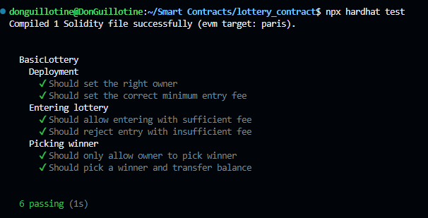

# Basic Lottery Smart Contract

This project implements a simple lottery system on the Lisk Sepolia testnet using Solidity and Hardhat. Participants can enter the lottery by sending Ether, and after a certain time period, a winner is randomly selected to receive the entire balance.

## Contract Address

The Basic Lottery Contract is deployed on the Lisk Sepolia testnet at:

`0x53d7F21a35Bbd27EA52A7ED2d25a20b2722b3704`

The contract has been verified on Etherscan for transparency and easy interaction.

## Features

- Participants can enter the lottery by sending a minimum amount of Ether
- Lottery has a maximum number of participants
- Time-based lottery end
- Random winner selection using block data
- Only the contract owner can trigger the winner selection
- Automatic prize distribution to the winner
- Reset functionality for starting a new lottery round

## Technologies Used

- Solidity 0.8.24
- Hardhat
- Ethers.js v6
- OpenZeppelin Contracts v5
- Lisk Sepolia Testnet

## Prerequisites

- Node.js (v14+ recommended)
- npm (usually comes with Node.js)
- An Ethereum wallet with Lisk Sepolia testnet ETH

## Setup

1. Clone the repository:
   ```
   git clone https://github.com/DonGuillotine/lottery-smart-contract.git
   cd lottery-smart-contract
   ```

2. Install dependencies:
   ```
   npm install
   ```

3. Create a `.env` file in the root directory with the following contents:
   ```
   LISK_SEPOLIA_RPC_URL=your_rpc.sepolia-api_url
   PRIVATE_KEY=your_wallet_private_key
   ETHERSCAN_API_KEY=your_etherscan_api_key
   ```

## Compilation

Compile the smart contract using Hardhat:

```
npx hardhat compile
```

## Testing

Run the test suite:

```
npx hardhat test
```

#### Basic Tests passed



## Deployment

To deploy the contract to the Lisk Sepolia testnet:

```
npx hardhat run scripts/deploy.js --network sepolia
```

## Interacting with the Contract

You can interact with the deployed contract through Etherscan or by using a script with ethers.js. Here are some example interactions:

1. Entering the lottery:
   ```javascript
   const contractAddress = "0x53d7F21a35Bbd27EA52A7ED2d25a20b2722b3704";
   const BasicLottery = await ethers.getContractFactory("BasicLottery");
   const lottery = BasicLottery.attach(contractAddress);

   await lottery.enter({ value: ethers.parseEther("0.01") });
   ```

2. Checking participants:
   ```javascript
   const participants = await lottery.getParticipants();
   console.log("Current participants:", participants);
   ```

3. Getting lottery info:
   ```javascript
   const balance = await lottery.getBalance();
   const timeLeft = await lottery.getTimeLeft();
   console.log("Current balance:", ethers.formatEther(balance), "ETH");
   console.log("Time left:", timeLeft.toString(), "seconds");
   ```

4. Picking a winner (only callable by the owner):
   ```javascript
   await lottery.pickWinner();
   ```

## Security Considerations

- The random number generation in this contract is not cryptographically secure. For a production environment, consider using Chainlink VRF or a similar oracle service.
- The contract uses OpenZeppelin's `ReentrancyGuard` to prevent reentrancy attacks.
- Ensure that only trusted addresses have owner privileges.

## Contributing

Contributions are welcome! Please feel free to submit a Pull Request.

## License

This project is licensed under the MIT License.

## Disclaimer

This smart contract is for educational purposes only. Use at your own risk. Always perform thorough testing and auditing before using any smart contract in a production environment.
